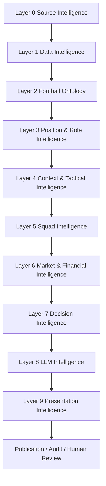
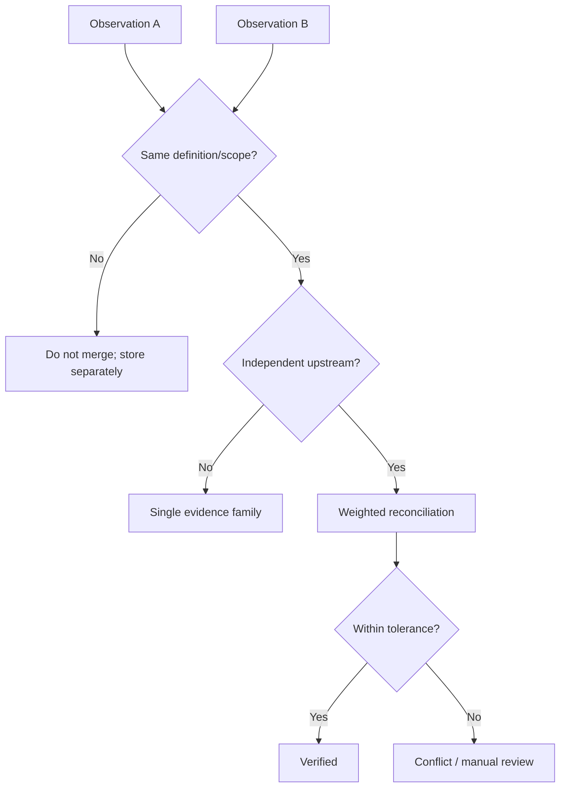
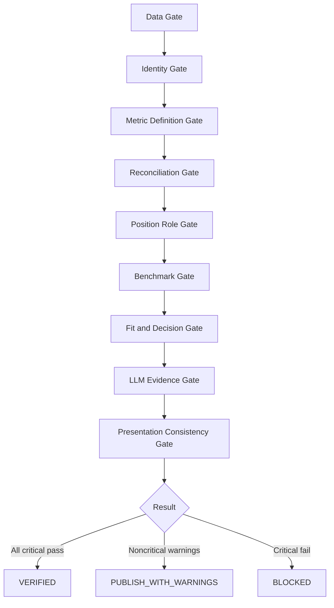

# FSRS v4.0 — Nihai Football Intelligence Reference Architecture

**Durum:** Production Reference Standard  
**Dil:** Türkçe  
**Amaç:** V2'nin veri mühendisliği disiplinini, V3'ün pozisyon/rol futbol zekâsını ve karar destek katmanlarını tek, izlenebilir, test edilebilir ve uzun ömürlü mimaride birleştirmek.

> FSRS'nin temel hükmü: **Doğrulanmamış gerçek rapora giremez; bağlamsız metrik karar puanına dönüşemez; kanıtsız LLM yorumu yayımlanamaz.**

---

## 1. Bu paket neden oluşturuldu?

V2 çok kaynaklı veri toplama, canonical model, provenance, validation, reconciliation ve publication gate alanlarında güçlüydü. V3; pozisyon, rol, arketip, çoklu pozisyon, pozisyona özel benchmark ve rapor modüllerini ekledi. V4 bu iki sistemi yan yana koymaz; **katman sınırları, sözleşmeler ve geri izlenebilirlik ile birleştirir.**

V4'te:

- veri mühendisliği katmanı futbol yorumundan bağımsızdır;
- futbol ontolojisi kod içine gömülü string listesi değildir;
- her metrik bir semantic registry girdisidir;
- her rol, gerekli ve çelişen davranış kanıtlarını tanımlar;
- her percentile tam benchmark kimliği taşır;
- tactical fit, squad fit ve market fit birbirine karıştırılmaz;
- LLM hiçbir deterministik skoru hesaplamaz veya değiştirmez;
- nihai rapordaki her iddia kaynağa ve metrik kanıtına geri izlenebilir.

---

## 2. Hedef kalite: neden 99/100?

Bu mimari 99/100 hedefler; çünkü aşağıdaki dokuz kontrol düzlemini birlikte zorunlu kılar:

1. Kaynak doğruluğu ve edinim hukuku
2. Kimlik çözümleme ve canonical normalizasyon
3. Metric definition governance
4. Validation, reconciliation ve conflict handling
5. Position-role-archetype ontolojisi
6. Contextual benchmark ve uncertainty
7. Tactical, squad ve market intelligence ayrımı
8. Evidence-bound LLM
9. Publication gate, observability ve human review

Mutlak 100 iddiası yapılmaz. Futbol verisi eksik, sağlayıcı tanımları farklı ve gelecek projeksiyonları belirsiz olabilir. Sistem bu belirsizliği gizlemek yerine ölçer ve yayımlar.

---

## 3. Değişmez ilkeler

1. **Raw immutable:** Ham kanıt değiştirilemez.
2. **Provenance mandatory:** Her gerçek source, retrieval time, scope ve evidence hash taşır.
3. **Null semantics:** `0`, `null`, `unavailable`, `not_applicable`, `estimated`, `conflict` eş anlamlı değildir.
4. **Definition before value:** Metrik değeri, metrik tanımı olmadan geçerli değildir.
5. **No scrape-time merge:** Kaynaklar edinim aşamasında birleştirilmez.
6. **Independent confirmation:** Aynı upstream sağlayıcıyı kullanan iki site bağımsız doğrulama sayılmaz.
7. **Scope identity:** Sezon, yarışma, takım, pozisyon, rol ve dakika kapsamı uyuşmadan veri kıyaslanamaz.
8. **Position ≠ role:** Pozisyon etiketi rol sınıflandırması değildir.
9. **Heatmap is evidence, not truth:** Isı haritası tek başına rol belirlemez.
10. **Percentile is contextual:** Percentile, benchmark kimliği olmadan yayımlanamaz.
11. **LLM cannot calculate facts:** LLM per90, percentile, fit score, risk veya max bid hesaplamaz.
12. **Evidence-bound narrative:** Her LLM iddiası kanıt ID'si taşır.
13. **Current ability ≠ potential:** Ayrı modeller ve belirsizlik aralıklarıdır.
14. **Presentation is downstream:** UI/PDF hiçbir veri üretmez.
15. **Fail closed:** Kritik gate başarısızsa rapor üretilmez.

---

## 4. Nihai katman mimarisi



### Layer 0 — Source Intelligence
Kaynak izinleri, acquisition adapter, crawl budget, rate limit, snapshot ve upstream dependency.

### Layer 1 — Data Intelligence
Identity resolution, canonical normalization, metric semantics, validation, reconciliation, verified facts.

### Layer 2 — Football Ontology
Position, role, archetype, behaviour, phase, zone ve metric ilişkileri.

### Layer 3 — Position & Role Intelligence
Çoklu pozisyon sınıflandırması, role detection, pozisyona özel engine, contextual percentile.

### Layer 4 — Context & Tactical Intelligence
Takım stili, lig seviyesi, rakip gücü, possession, game state ve tactical fit.

### Layer 5 — Squad Intelligence
Kadro ihtiyacı, rol çakışması, partner synergy, depth chart ve replacement impact.

### Layer 6 — Market & Financial Intelligence
Sözleşme, piyasa, ücret, amortisman, resale, deal risk ve price discipline.

### Layer 7 — Decision Intelligence
Sign/monitor/avoid, max bid, ideal kullanım, risk register ve alternatif shortlist.

### Layer 8 — LLM Intelligence
Doğrulanmış gerçekleri açıklayan, karşılaştıran ve raporlayan evidence-bound yorum katmanı.

### Layer 9 — Presentation Intelligence
GK/CB/FB/DM/CM/AM/WINGER/ST özel UI, PDF, kart ve API view modelleri.

---

## 5. Uçtan uca veri akışı


---

## 6. JSON aileleri ve neden var oldukları

| JSON | Neden vardır? | Nereden beslenir? | Neyle karşılaştırılır? |
|---|---|---|---|
| `source_raw_snapshot.json` | Kaynağın değiştirilmemiş kanıtını saklar | API/HTML/network payload | source policy, hash, schema |
| `source_lineage.json` | Kaynakların aynı upstream'e bağlı olup olmadığını bilir | provider araştırması | independence policy |
| `identity_candidate.json` | Aynı isimli oyuncuları ayırır | isim, doğum, takım, external IDs | canonical identity |
| `canonical_player.json` | Kaynak bağımsız tek oyuncu modeli | normalized source records | canonical schema |
| `metric_observation.json` | Her değeri definition + scope + provenance ile taşır | source adapters | metric registry |
| `reconciliation_case.json` | Çelişen değerlerin karar kaydını tutar | metric observations | source reliability + freshness |
| `verified_player.json` | Yayınlanabilir doğrulanmış gerçekleri tutar | reconciliation | publication data gate |
| `position_evidence.json` | Pozisyon iddiasının kanıtlarını tutar | lineup + event zones | position taxonomy |
| `role_classification.json` | Rol ve arketip kararını açıklar | position evidence + metrics | role ontology |
| `benchmark_definition.json` | Percentile evrenini tanımlar | cohort builder | benchmark policy |
| `feature_vector.json` | Ham metriği futbol davranışına dönüştürür | deterministic metrics | feature registry |
| `team_context.json` | Oyuncu performansının takım bağlamını tanımlar | team/event data | context registry |
| `tactical_fit.json` | Hedef oyun modeliyle eşleşmeyi ölçer | player + target role | tactical requirements |
| `squad_fit.json` | Mevcut kadro içindeki marjinal katkıyı ölçer | squad roster | depth chart + role needs |
| `financial_model.json` | Transfer maliyeti ve riskini modellendirir | contract/market/wage | financial policy |
| `decision_record.json` | Nihai deterministik öneriyi kaydeder | all intelligence layers | decision policy |
| `llm_analysis_input.json` | LLM'ye izin verilen bilgiyi sınırlar | verified decision package | prompt contract |
| `llm_analysis_output.json` | Yorumların kanıt bağını zorunlu kılar | LLM | output schema + evidence validator |
| `final_report.json` | Tüm sunumların tek kaynağıdır | validated LLM + deterministic outputs | publication gate |

Her JSON'un bulunduğu klasörde aynı isimli veya ilişkili bir `.md` dosyası; **neden, kaynak önceliği, karşılaştırma, validation, eksiklik ve tüketici katmanını** açıklar.

---

## 7. Kaynak seçim ilkesi

Kaynak adı hard-code edilmez; kaynak sınıfı ve metrik uygunluğu tanımlanır.

### En güvenilir kaynak sırası

1. Resmî kulüp/lig/federasyon kayıtları
2. Lisanslı event/tracking provider
3. Resmî maç raporu veya competition feed
4. Güvenilir structured public provider
5. Güvenilir transfer/contract database
6. İkincil haber/medya kaynağı
7. Kullanıcı/LLM tahmini — **fact olarak yasak**

### Alan bazlı öneri

- Kimlik/uyruk/doğum: resmî federasyon, lig, kulüp
- Maç ve dakika: resmî competition feed veya güvenilir event provider
- Event metrics: tanımı açık lisanslı/structured provider
- Sözleşme: kulüp açıklaması; yoksa güvenilir transfer database + açık uncertainty
- Ücret: resmî finansal rapor; aksi halde estimated ve düşük confidence
- Piyasa değeri: market estimate olarak etiketlenir, gerçek transfer ücreti değildir
- Injury: kulüp açıklaması/lig kayıtları; medya iddiası ayrı sınıf
- Heatmap: raw event coordinates tercih edilir; görüntüden türetilmiş harita düşük güvenlidir

---

## 8. Kaynak bağımsızlığı ve reconciliation



Bir değer yalnızca şu şartlarda başka kaynaktan doldurulur:

- canonical player aynı,
- sezon ve yarışma kapsamı aynı,
- takım ve pozisyon kapsamı aynı,
- metric definition version aynı,
- unit aynı,
- aggregation yöntemi aynı.

Aksi durumda `null` korunur.

---

## 9. Football Ontology

```text
Position → Role → Archetype → Behaviour → Phase → Zone → Metric Evidence
```

Örnek:

```text
RW
└── Inside Forward
    └── Scoring Inside Forward
        ├── Behaviour: inside carry
        ├── Behaviour: high shot volume
        ├── Phase: transition / settled attack
        ├── Zone: right half-space / central box
        └── Metrics: npxG/90, box touches, carries into box, shot map
```

Rol bir string değil, registry objesidir. Registry; gerekli metrikleri, çelişen davranışları, minimum dakikayı, benchmark evrenini, prompt route'u ve report modüllerini belirler.

---

## 10. Çoklu pozisyon ve çift ayaklılık

Çift ayaklılık, otomatik çoklu rol kalitesi değildir. Aşağıdakiler ayrı tutulur:

- preferred foot ve weak-foot usage
- sağ/sol ayak pas, şut, orta ve carry oranları
- RW/LW/CF dakika dağılımı
- position-specific heatmaps
- her pozisyon için rol ve percentile
- ters ayak / doğal ayak davranışı

Nihai versatility yalnızca üç koşul birlikte varsa yüksek olabilir:

1. Yeterli dakika
2. Pozisyon özel benchmarkta kabul edilebilir üretim
3. Rol kanıtı ve taktik aktarılabilirlik

---

## 11. Pozisyon motorları

Core engine'ler:

```text
GK / CB / FB / DM / CM / AM / WINGER / ST
```

Her engine şunları ayrı tanımlar:

- required metrics
- critical metrics
- optional metrics
- role archetypes
- feature equations
- benchmark filters
- sample reliability
- blocking rules
- LLM route
- report modules

Örnek GK kritik başlıkları: PSxG, save%, one-v-one, cross claim, high ball, sweep, short/long distribution, pressure pass, errors.

Örnek WINGER kritik başlıkları: dribble, carry, wide/half-space usage, xG threat, creation, transition, pressing/tracking.

---

## 12. Percentile ve benchmark standardı

Her percentile aşağıdaki kimliği taşır:

```text
metricDefinitionVersion
seasonWindow
competitionTier
competitionSet
positionGroup
roleId
ageBand
minimumMinutes
sampleSize
normalizationMethod
benchmarkVersion
```

Percentile şu durumlarda yayımlanmaz:

- sample population çok küçükse,
- metric definition farklıysa,
- rol ve pozisyon kapsamı karışmışsa,
- veri coverage eşik altında ise,
- oyuncu dakika güvenilirliği yetersizse.

---

## 13. Context Intelligence

Oyuncu performansı takım bağlamından ayrılmaz. Zorunlu bağlamlar:

- takım possession band
- field tilt
- attacking/defensive volume
- league strength band
- opponent strength
- game state
- formation
- role instruction
- set-piece share
- penalty share
- team finishing environment

Context-adjusted değerler raw değerin yerine geçmez; ayrı metrik olarak tutulur.

---

## 14. Tactical Fit, Squad Fit ve Market Fit ayrımı

### Tactical Fit
Oyuncu hedef oyun modelinde rolü yerine getirebilir mi?

### Squad Fit
Mevcut kadroda hangi problemi çözer, kimle çakışır, kiminle sinerji kurar?

### Market Fit
Maliyet, ücret, sözleşme, yaş, resale ve risk kulüp politikasına uyuyor mu?

Bu üç skor ayrı hesaplanır. Tek bir “uyum” sayısında erken birleştirilmez.

---

## 15. Decision Intelligence

Nihai öneri deterministiktir:

```text
PRIORITY_SIGNING
SIGN
SIGN_IF_PRICE_FITS
MONITOR
DEVELOPMENT_SIGNING
LOAN_AND_MONITOR
DO_NOT_SIGN_YET
AVOID
INSUFFICIENT_DATA
```

Decision record şunları içerir:

- current ability
- potential range
- tactical fit
- squad marginal impact
- financial risk
- injury/availability risk
- data confidence
- max bid range
- wage discipline
- ideal contract length
- deployment recommendation
- key failure modes
- alternatives requirement

LLM sınıfı değiştiremez; yalnızca gerekçeyi açıklar.

---

## 16. LLM güvenlik sözleşmesi

LLM input yalnızca:

- verified facts,
- deterministic metrics,
- role evidence,
- benchmark results,
- fit scores,
- explicit limitations

içerir.

LLM output'taki her iddia:

```json
{
  "claimId": "claim-001",
  "text": "...",
  "claimType": "interpretation",
  "evidenceMetricIds": ["metric-..."],
  "confidence": 0.84
}
```

şeklindedir.

Kanıtsız iddia Publication Gate tarafından silinmez; rapor **BLOCKED** olur. Böylece hatalar görünmez şekilde gizlenmez.

---

## 17. Publication Gate



Kritik bloklama örnekleri:

- identity ambiguity
- stale current club/contract status
- metric definition mismatch
- null converted to zero
- position/role confidence below threshold
- mixed-position percentile
- insufficient benchmark population
- LLM claim without evidence
- wrong position renderer
- financial estimate shown as verified

---

## 18. Ana klasör haritası

```text
00_GOVERNANCE/                  bağlayıcı ilkeler ve değişiklik yönetimi
01_SOURCE_INTELLIGENCE/         kaynak/adaptör/upstream/crawl sözleşmeleri
02_DATA_INTELLIGENCE/           canonical, metric, validation, reconciliation
03_FOOTBALL_ONTOLOGY/           position-role-archetype-behaviour bilgi modeli
04_POSITION_ROLE_INTELLIGENCE/  engine ve benchmark kuralları
05_CONTEXT_TACTICAL_INTELLIGENCE/ context ve tactical fit
06_SQUAD_INTELLIGENCE/          kadro, synergy, depth chart
07_MARKET_FINANCIAL_INTELLIGENCE/ contract, market, financial model
08_DECISION_INTELLIGENCE/       recommendation ve risk
09_LLM_INTELLIGENCE/            prompt/input/output/evidence contract
10_PRESENTATION_INTELLIGENCE/   report/UI/PDF modules
11_QA_OBSERVABILITY/            tests, drift, audit, publication gates
12_IMPLEMENTATION/              roadmap ve service boundaries
13_EXAMPLES/                    uçtan uca örnekler
schemas/                        machine validation
policies/                       deterministic rules
registries/                     semantic definitions
prompts/contracts/              prompt route contracts
tests/                          pass/fail fixtures
migration/                      V2/V3 → V4 geçişi
```

---

## 19. Uygulama sırası

1. Governance + schema versioning
2. Source registry + lineage
3. Identity and canonical contracts
4. Metric semantic registry
5. Validation/reconciliation engine
6. Verified player package
7. Football ontology registry
8. Position evidence and role detection
9. Position engines and role benchmarks
10. Context adjustment
11. Tactical fit
12. Squad intelligence
13. Financial model
14. Decision engine
15. LLM evidence binding
16. Position-specific presentation
17. Historical backtest
18. Human scout calibration
19. Drift monitoring
20. Production publication gate

İlk 6 adım bitmeden LLM veya görsel rapor geliştirilmemelidir.

---

## 20. Nihai kabul kriteri

FSRS v4 ancak şu durumda production-ready sayılır:

- her JSON schema ile doğrulanıyor;
- her registry versioned;
- source lineage biliniyor;
- null semantics test ediliyor;
- role classification backtest ediliyor;
- benchmark population audit ediliyor;
- decision score reproducible;
- LLM claims evidence-bound;
- UI final report dışında veri kullanmıyor;
- en az bir GK, CB, FB, DM, CM, AM, WINGER ve ST golden fixture geçiyor;
- manual scout review kaydı ve model disagreement kaydı tutuluyor.

---

## 21. Son hüküm

V4, V2'nin veri mühendisliğinden ödün vermez. V3'ün futbol zekâsını verified data katmanının üzerine bağımsız ve versioned bir intelligence sistemi olarak kurar.

```text
Verified Evidence
+ Semantic Football Ontology
+ Position/Role Intelligence
+ Context
+ Tactical/Squad/Market Fit
+ Deterministic Decision
+ Evidence-Bound LLM
= FSRS v4
```
