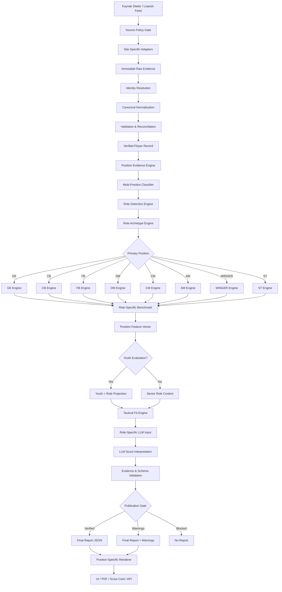

# FSRS v3.0 — Role Intelligence Football Scouting Standard

Bu paket, futbolcu verisini yalnızca toplayan ve doğrulayan bir sistem değil; oyuncuyu **pozisyon, rol, arketip, ayak kullanımı, saha bölgeleri, görev profili, takım bağlamı ve gelişim evresi** üzerinden değerlendiren production-grade bir Football Intelligence Platform standardıdır.

Bu dosya ile beraber `policies/`, `schemas/`, `templates/`, `docs/` ve `tests/` altındaki sözleşmeler bağlayıcıdır. Kod, prompt, scraper, benchmark, puanlama, UI ve PDF katmanları bu sözleşmelere uymalıdır.

> Ana ilke: **Kulüpler yalnızca pozisyon transfer etmez; belirli bir oyun rolünü ve problemi çözecek futbolcuyu transfer eder.**

---

## 1. Sistem vizyonu

Sistem şu soruya cevap vermemelidir:

> “Bu oyuncu iyi mi?”

Şu soruların tamamına cevap vermelidir:

- Hangi pozisyonlarda gerçekten oynamış?
- Hangi pozisyonda kaç dakika oynamış?
- Hangi ayağıyla hangi bölgelerde daha etkili?
- Aynı pozisyon adı altında hangi role sahip?
- Rolü sezonlar arasında değişmiş mi?
- Isı haritası, aksiyon konumu ve pas/şut profili rol iddiasını doğruluyor mu?
- Oyuncu birden fazla role hangi güven seviyesinde uyuyor?
- Her rol için hangi metriklerle kıyaslanmalı?
- Hangi benchmark evreni kullanılmalı?
- Hangi veri kaynakları bu değerlendirme için yeterli?
- Mevcut takım sistemi performansı ne kadar etkiliyor?
- Hedef kulübün oyun modeline uyumu nedir?
- Oyuncunun mevcut seviyesi, potansiyeli ve transfer riski nedir?
- Rapor hangi veri eksikleri nedeniyle sınırlandırılmıştır?

---

## 2. V3 ile gelen ana değişiklik

V2 veri merkezliydi:

```text
Player → Verified Data → Metrics → LLM → Report
```

V3 rol merkezlidir:

```text
Player
  ↓
Position Evidence
  ↓
Multi-Position Classification
  ↓
Role Detection
  ↓
Role Archetype Classification
  ↓
Position/Role-Specific Metric Selection
  ↓
Position/Role-Specific Benchmark
  ↓
Position/Role Feature Engineering
  ↓
Role-Specific LLM Contract
  ↓
Position-Specific Report Renderer
```

Bu değişiklik yalnızca rapor tasarımını değil; veri çekme, normalizasyon, percentile, feature engineering, LLM ve QA yapısını değiştirir.

---

## 3. Bağlayıcı uçtan uca mimari

```text
Public / Licensed Football Data Sources
Official APIs / Licensed Feeds / Permitted Public Pages
                           │
                           ▼
                Source Policy & Legal Gate
 izin, lisans, robots, ticari kullanım, crawl budget
                           │
                           ▼
               Site-Specific Acquisition Adapters
 identity / lineups / positions / events / stats / contracts
                           │
                           ▼
                  Immutable Raw Evidence Store
 JSON / HTML / network payload / screenshot / hashes
                           │
                           ▼
                  Identity Resolution Engine
 canonical player, team, competition, season, source IDs
                           │
                           ▼
                  Canonical Normalization
 metric definitions, units, scopes, event coordinates
                           │
                           ▼
                Validation & Reconciliation
 source reliability, independence, freshness, conflicts
                           │
                           ▼
                     Verified Player Record
 facts + provenance + confidence + unresolved limitations
                           │
                           ▼
                 Position Evidence Engine
 lineup positions + event zones + heatmap + average position
                           │
                           ▼
             Multi-Position Classification Engine
 primary / secondary / tertiary + minutes share + confidence
                           │
                           ▼
                    Role Detection Engine
 e.g. RW → inside forward / wide creator / touchline winger
                           │
                           ▼
                 Role Archetype Classification
 scoring inside forward / transition winger / false 9 etc.
                           │
                           ▼
      Position & Role Specific Metric Selection Engine
 GK, CB, FB, DM, CM, AM, WINGER, ST metric contracts
                           │
                           ▼
        Role-Specific Benchmark & Percentile Engine
 position + role + league tier + age + minutes + season
                           │
                           ▼
              Position Feature Engineering Engine
 shot stopping / progression / creation / box threat etc.
                           │
                           ▼
           Youth or Senior Evaluation Context Engine
 development velocity / senior transition / potential range
                           │
                           ▼
                 Tactical Fit Matching Engine
 target club role requirements vs player role vector
                           │
                           ▼
                 LLM Analysis Input Contract
 verified facts + role evidence + benchmarks + limitations
                           │
                           ▼
                Role-Specific LLM Interpretation
 no facts invented, every claim evidence-bound
                           │
                           ▼
                    Publication & QA Gate
                           │
                           ▼
                    Final Report JSON
                           │
                           ▼
     GK / CB / FB / DM / CM / AM / WINGER / ST Renderer
                           │
                           ▼
                  UI / PDF / Scout Card / API
```

---

## 4. Değişmez veri ilkeleri

1. Ham veri değiştirilemez.
2. `0`, `null`, `unavailable`, `not_applicable`, `conflict`, `estimated` farklıdır.
3. Aynı isimdeki metrikler tanım eşleşmeden birleştirilemez.
4. Aynı upstream provider bağımsız doğrulama sayılmaz.
5. LLM veri çekmez, veri düzeltmez, percentile veya per90 hesaplamaz.
6. Pozisyon yalnızca kaynak etiketiyle belirlenmez.
7. Rol yalnızca ısı haritasıyla belirlenmez.
8. Isı haritası tek başına taktik rol kanıtı değildir.
9. Çoklu pozisyon oyuncuları tek pozisyon benchmarkına zorla sokulamaz.
10. Her pozisyon/rol ayrı metrik sözleşmesi kullanır.
11. Her percentile, benchmark bağlamı taşır.
12. Her LLM iddiası `evidenceMetricIds` taşır.
13. Current Ability ve Potential ayrı tutulur.
14. Genç oyuncu senior ve yaş kohortu benchmarklarıyla ayrı değerlendirilir.
15. Bütün sunum katmanları tek `final_report.json` üzerinden beslenir.

---

## 5. Pozisyon taksonomisi

### 5.1 Ana pozisyon grupları

```text
GK
CB
FB
DM
CM
AM
WINGER
ST
```

### 5.2 Yan ve hibrit pozisyon etiketleri

```text
RCB / LCB
RB / LB
RWB / LWB
RDM / LDM
RCM / LCM
RAM / LAM
RW / LW
RCF / LCF
SS
CF
```

### 5.3 Position ≠ Role ≠ Archetype

Örnek:

```text
Position: RW
Role: Inside Forward
Archetype: Scoring Inside Forward
```

Başka örnek:

```text
Position: ST
Role: False Nine
Archetype: Creative False Nine
```

---

## 6. Çoklu pozisyon oyuncu modeli

Her oyuncu için:

- kariyer dakika payı,
- son üç sezon dakika payı,
- güncel sezon dakika payı,
- başlangıç pozisyonu,
- gerçek aksiyon bölgeleri,
- ortalama pozisyon,
- top alma bölgeleri,
- şut bölgeleri,
- savunma aksiyon bölgeleri,
- teknik direktör/formasyon bağlamı

ayrı tutulur.

Örnek:

```json
{
  "positionProfile": {
    "primaryPosition": {
      "position": "RW",
      "minutesShare": 0.58,
      "confidence": 0.93
    },
    "secondaryPositions": [
      {"position": "CF", "minutesShare": 0.23, "confidence": 0.84},
      {"position": "LW", "minutesShare": 0.19, "confidence": 0.81}
    ]
  }
}
```

Bir oyuncunun “çift ayaklı” olması, otomatik olarak iki kanatta aynı rol kalitesinde olduğu anlamına gelmez. Şunlar ayrı ölçülmelidir:

- sağ/sol ayak aksiyon oranı,
- sağ/sol kanat dakika payı,
- ters ayak avantajı,
- çizgiye inme,
- iç koridora kat etme,
- şut açısı,
- orta üretimi,
- pas yönelimi,
- savunma yönelimi.

---

## 7. Position Evidence Engine

Pozisyon sınıflandırma kanıtları:

| Kanıt | Önerilen ağırlık |
|---|---:|
| Resmi başlangıç pozisyonu | 0.25 |
| Dakika bazlı lineup rolü | 0.20 |
| Ortalama saha pozisyonu | 0.15 |
| Aksiyon koordinat dağılımı | 0.15 |
| Top alma bölgeleri | 0.10 |
| Şut/pas bölgeleri | 0.05 |
| Formasyon bağlamı | 0.05 |
| Güvenilir üçüncü taraf pozisyon etiketi | 0.05 |

Isı haritası yalnızca destekleyici kanıttır. Tek başına pozisyon belirlemez.

---

## 8. Role Detection Engine

Rol sınıflandırması şu girdileri kullanır:

- pozisyon ve dakika payı
- event coordinates
- average position
- touch zones
- pass direction and length
- progressive actions
- shot locations
- crossing profile
- carrying profile
- defensive action height
- pressure and pressing data
- receiving zones
- formation and team possession context

Her rol çıktısı:

```json
{
  "roleId": "WINGER_INSIDE_FORWARD",
  "confidence": 0.91,
  "evidenceMetricIds": [],
  "contradictingEvidenceMetricIds": [],
  "sampleMinutes": 1800,
  "scope": {}
}
```

---

## 9. Role Archetype Engine

Rolün daha ince oyun karakteri:

### Kanat örnekleri
- scoring_inside_forward
- creative_inside_forward
- touchline_creator
- transition_runner
- high_volume_dribbler
- wide_playmaker

### Santrafor örnekleri
- poacher
- advanced_forward
- complete_forward
- target_forward
- pressing_forward
- false_nine
- channel_forward

### Kaleci örnekleri
- line_goalkeeper
- shot_stopper
- sweeper_keeper
- build_up_goalkeeper
- aggressive_cross_collector

Arketipler mutually exclusive olmak zorunda değildir. Sistem primary + secondary archetype üretebilir.

---

## 10. Pozisyona özel veri motorları

### GK Engine
Zorunlu ana gruplar:
- shot stopping
- post-shot xG performance
- clean sheets
- one-v-one
- penalties
- cross claiming
- high balls
- sweeping
- short distribution
- long distribution
- pressure passing
- errors
- command of area

### CB Engine
- aerial defending
- ground duels
- front-foot defending
- recovery defending
- box defending
- interceptions
- progression
- line-breaking passing
- carrying
- press resistance
- errors
- discipline

### FB Engine
- overlap
- underlap
- crossing
- progression
- final-third entries
- recovery runs
- wide defending
- transition defense
- inverted build-up
- ball retention

### DM Engine
- ball recovery
- screening
- rest defense
- first-phase build-up
- line-breaking passing
- pressure resistance
- tempo control
- counterpress
- central occupation
- turnover security

### CM Engine
- progression
- ball circulation
- box-to-box coverage
- creation
- carrying
- counterpress
- tempo
- final-third arrival
- duel contribution

### AM Engine
- pocket receiving
- chance creation
- through balls
- half-space use
- combinations
- final-third progression
- box entries
- shot creation
- pressure resistance

### WINGER Engine
- isolation dribbling
- ball carrying
- wide progression
- inside threat
- box threat
- shot volume/quality
- chance creation
- crossing
- transition threat
- pressing and tracking

### ST Engine
- box movement
- shot quality
- finishing
- xG production
- near/far post threat
- aerial threat
- runs behind
- link play
- hold-up
- channel movement
- pressing
- penalty-box touches

Her engine için ayrı JSON policy, template, schema, benchmark ve report module bulunur.

---

## 11. Pozisyona özel percentile

Percentile karşılaştırmaları zorunlu olarak şu anahtarı taşır:

```text
season
competitionTier
competition
positionGroup
roleId
ageBand
minimumMinutes
samplePopulation
metricDefinitionVersion
benchmarkVersion
```

Örnek:

```text
Greenwood goals/90
→ Ligue 1 RW
→ Inside Forward
→ U25
→ minimum 900 minutes
```

Aynı oyuncunun CF rolündeki percentile sonucu ayrı tutulur.

---

## 12. Pozisyon bazlı rapor kartları

Tüm kartlar aynı Core Layout’u kullanır; ancak içerik modülleri pozisyona göre değişir.

```text
Core Layout
├── GK Template
├── CB Template
├── FB Template
├── DM Template
├── CM Template
├── AM Template
├── WINGER Template
└── ST Template
```

Örnek GK görsel modülleri:
- kale ve ceza sahası aksiyon haritası
- kurtarış bölgeleri
- PSxG grafiği
- penaltı performansı
- orta/yan top profili
- dağıtım yön haritası
- kaleci eldiveni tematik ikonu

Örnek WINGER modülleri:
- kanat/yarı alan dokunma bölgeleri
- içe kat / çizgi kullanım oranı
- dripling başlangıç-bitiş haritası
- şut bölgeleri
- yaratım ve taşıma profili
- RW/LW/CF rol dağılımı

Tematik görseller yalnızca sunum katmanındadır; veri modeline etki etmez.

---

## 13. Greenwood gibi hibrit oyuncu örneği

```text
Primary Position: RW
Secondary: CF
Tertiary: LW
Preferred Foot Profile: Two-foot capable
Primary Role: Scoring Inside Forward
Secondary Role: Channel Forward
Tertiary Role: Creative Inside Forward
```

Sistem üç ayrı değerlendirme üretir:

1. RW / Scoring Inside Forward benchmarkı
2. CF / Channel Forward benchmarkı
3. LW / Creative Inside Forward benchmarkı

Nihai rapor:
- birincil rolü ana karar olarak,
- ikincil rolleri kadro esnekliği olarak,
- her rolün güvenini ve örneklem dakikasını
gösterir.

---

## 14. Heatmap standardı

Isı haritası:
- tek bir ekran görüntüsü olarak saklanmaz;
- normalize edilmiş grid/veri matrisi olarak saklanır;
- sezon, takım, pozisyon, rol ve dakika kapsamı taşır;
- farklı pozisyonlardaki dakikalar karıştırılmaz;
- mümkünse `touch`, `receive`, `carry`, `shot`, `defensive_action` haritaları ayrılır.

```json
{
  "mapType": "touch_density",
  "grid": "24x16",
  "normalizedDirection": "left_to_right",
  "scope": {
    "position": "RW",
    "roleId": "WINGER_INSIDE_FORWARD",
    "minutes": 1450
  }
}
```

---

## 15. Taktik fit

Hedef kulüp gereksinimi ayrı JSON sözleşmesidir:

```text
Formation
Build-up shape
Possession share
Press intensity
Defensive line
Transition frequency
Width responsibility
Role requirements
Risk tolerance
Age/financial policy
```

Oyuncu rol vektörü ile hedef rol vektörü deterministik olarak karşılaştırılır. LLM bu sonucu yorumlar; skoru icat etmez.

---

## 16. Genç oyuncu + rol motoru

Genç oyuncu yalnızca yaş kohortunda değil, **aynı rol kohortunda** kıyaslanmalıdır.

Örnek:

```text
U18 WINGER
Inside Forward
Competition Tier 2
Minimum 600 minutes
```

Potansiyel tahmini:
- mevcut rol üretimi,
- rol transferability,
- senior role adaptation,
- pozisyon değişim geçmişi,
- gelişim hızı,
- fiziksel olgunluk verisi durumu,
- örneklem güvenilirliği
ile üretilir.

---

## 17. LLM prompt routing

LLM promptu oyuncunun engine sonucuna göre seçilir:

```text
GK → goalkeeper_prompt
CB → centre_back_prompt
FB → full_back_prompt
DM → defensive_midfielder_prompt
CM → central_midfielder_prompt
AM → attacking_midfielder_prompt
WINGER → winger_prompt
ST → striker_prompt
```

Hibrit oyuncu:
- primary role promptu,
- secondary role comparison eki,
- multi-role risk ve versatility bölümü
ile analiz edilir.

---

## 18. Publication Gate — rol özel kurallar

Rapor engellenir:
- primary position confidence düşükse
- primary role confidence eşik altındaysa
- rol benchmark nüfusu yetersizse
- pozisyon bazlı zorunlu kritik metrikler yoksa
- heatmap kapsamı pozisyon kapsamıyla uyuşmuyorsa
- farklı pozisyonların verileri tek percentile’da birleştirildiyse
- LLM yanlış position promptu ile çalıştırıldıysa
- final report template yanlış engine ile render edildiyse

---

## 19. Dosya yapısı

```text
FSRS_Role_Intelligence_Standard_v3/
├── 00_README_TR.md
├── docs/
│   ├── 01_SOURCE_ACQUISITION_STANDARD.md
│   ├── ...
│   ├── 09_ROLE_INTELLIGENCE_STANDARD.md
│   ├── 10_MULTI_POSITION_PLAYER_STANDARD.md
│   ├── 11_HEATMAP_EVENT_COORDINATE_STANDARD.md
│   ├── 12_POSITION_SPECIFIC_REPORT_STANDARD.md
│   ├── 13_TACTICAL_FIT_STANDARD.md
│   └── position_engines/
│       ├── GK_ENGINE.md
│       ├── CB_ENGINE.md
│       ├── FB_ENGINE.md
│       ├── DM_ENGINE.md
│       ├── CM_ENGINE.md
│       ├── AM_ENGINE.md
│       ├── WINGER_ENGINE.md
│       └── ST_ENGINE.md
├── policies/
│   ├── position_taxonomy.json
│   ├── role_detection_policy.json
│   ├── multi_position_policy.json
│   ├── heatmap_policy.json
│   ├── tactical_fit_policy.json
│   ├── position_engines/*.json
│   ├── role_archetypes/*.json
│   └── report_modules/*.json
├── templates/
│   ├── position_evidence_template.json
│   ├── role_classification_template.json
│   ├── tactical_fit_input_template.json
│   ├── position_engines/*.json
│   └── mevcut v2 şablonları
├── schemas/
│   ├── position_evidence.schema.json
│   ├── role_classification.schema.json
│   ├── tactical_fit.schema.json
│   ├── position_engines/*.json
│   └── mevcut v2 şemaları
├── examples/
│   └── players/mason_greenwood/
└── tests/
    ├── role_validation_rules.json
    └── role_fixtures/
```

---

## 20. Uygulama sırası

1. Position taxonomy
2. Event coordinate normalization
3. Position evidence store
4. Multi-position classifier
5. Role archetype registry
6. Role detection engine
7. Position-specific metric contracts
8. Position-specific benchmark datasets
9. Position feature engines
10. Tactical fit engine
11. Role-specific prompt router
12. Position-specific renderer
13. Role QA fixtures
14. Historical backtest
15. Human scout calibration

---

## 21. Nihai diyagram



---

## 22. Nihai hüküm

V3 standardında sistemin merkezi yalnızca oyuncu değildir:

```text
Player
+ Position
+ Role
+ Archetype
+ Context
+ Evidence
```

Bu bileşenlerden herhangi biri eksikse değerlendirme tamamlanmış sayılmaz.
