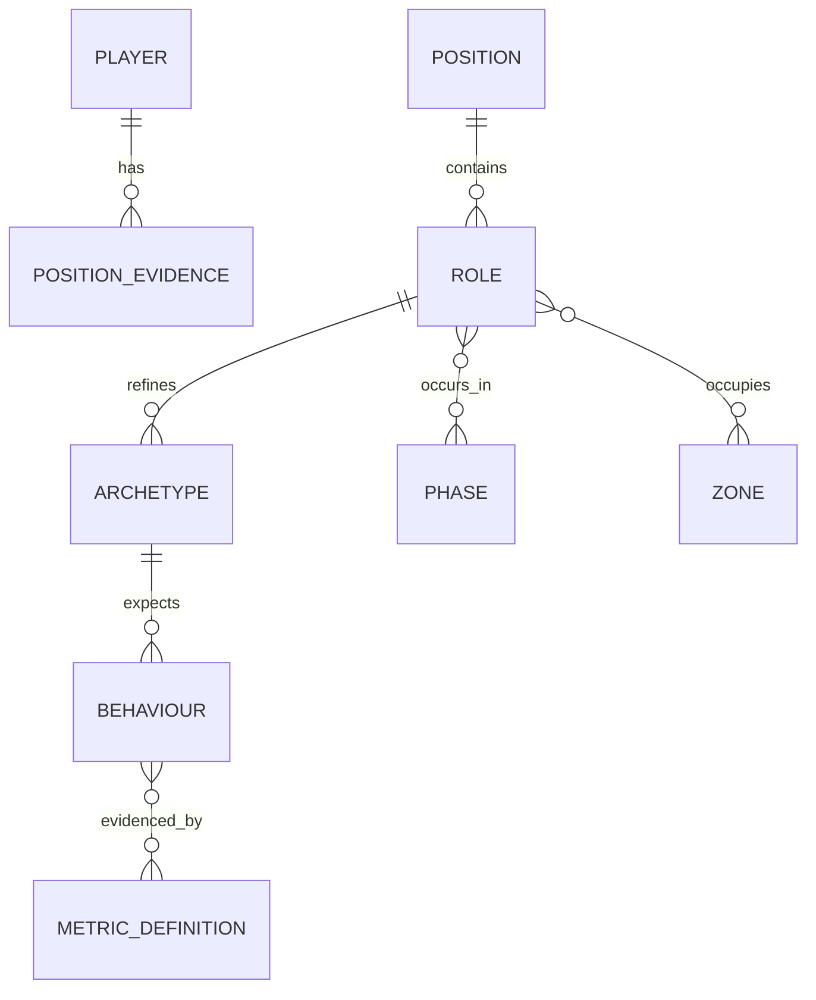

# Ontology Model

```mermaid
erDiagram
 PLAYER ||--o{ POSITION_EVIDENCE : has
 POSITION ||--o{ ROLE : contains
 ROLE ||--o{ ARCHETYPE : refines
 ARCHETYPE ||--o{ BEHAVIOUR : expects
 BEHAVIOUR }o--o{ METRIC_DEFINITION : evidenced_by
 ROLE }o--o{ PHASE : occurs_in
 ROLE }o--o{ ZONE : occupies
```

Rol tanımı; expected, supporting ve contradicting evidence listeleri taşır.
